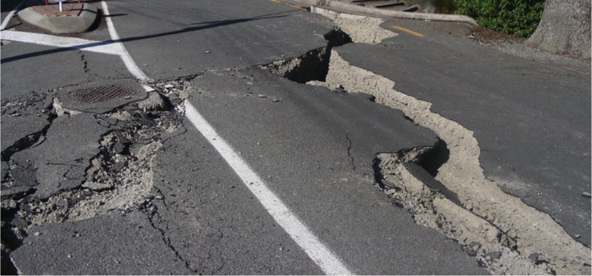
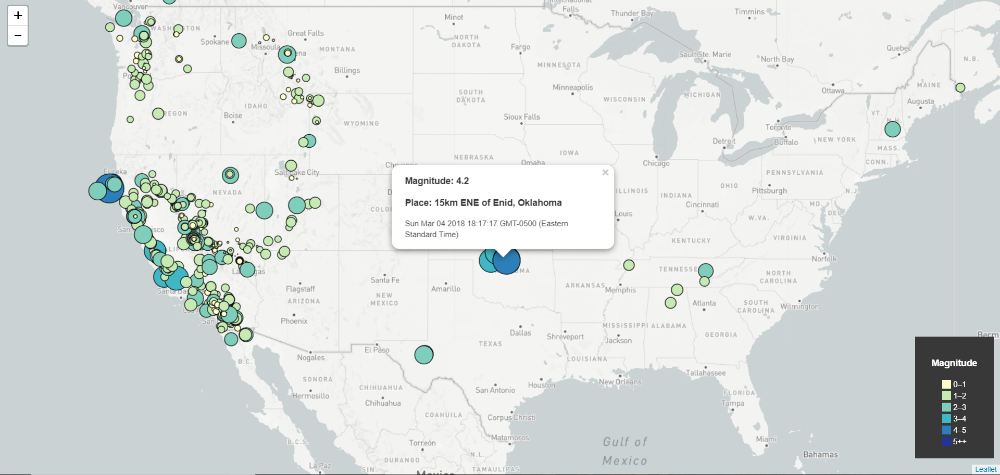
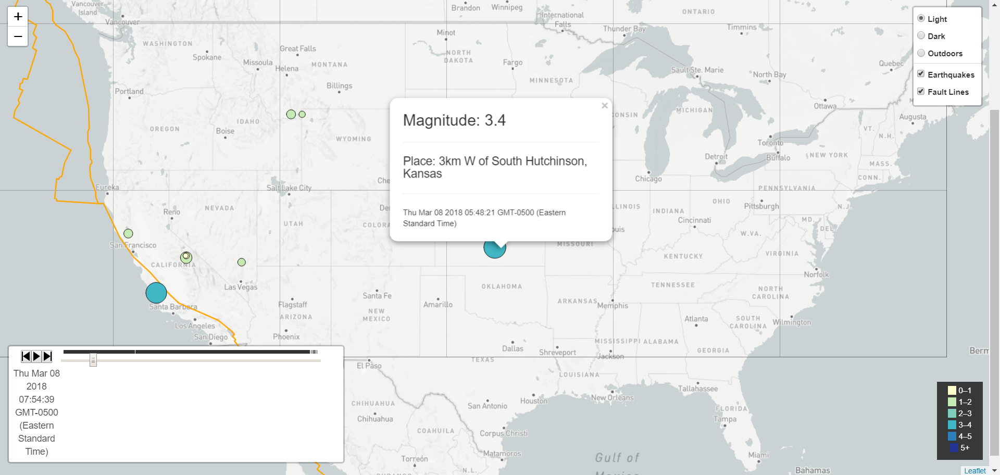

# Earthquakes-Over-Time

## Background

Problem: The USGS records data for all of the earthquakes that occur throughout the world on a daily basis.  The problem is that not many people are aware of how much seismological activity occurs on a regular basis.  The solution is to create a way to visualize their earthquake data from the last week that showcases how many quakes actually occur.

First, I created a map using Leaflet with Openmap and displayed it in a browser via HTML, CSS, & JavaScript.  

   My JavaScript pulls data from the USGS website which provides earthquake data in a number of different formats, updated every 5 minutes. To peruse the data for yourself, click the link: [USGS GeoJSON Feed](http://earthquake.usgs.gov/earthquakes/feed/v1.0/geojson.php) and pick a data set to visualize. Then I put the URL from my chosen data set (in this case, the last 7 days) into JavaScript so that when my script runs, it pulls fresh data.

   My map uses Leaflet to plots all of the earthquakes from the last week based on their longitude and latitude. The data markers reflect the magnitude of the earthquake in their size and color. Earthquakes with higher magnitudes appear larger and darker in color.
I also created popups that provide additional information about the earthquake when a marker is clicked. There are also layer controls in the top right hand corner where you can toggle between map styles and the datasets. Finally, I created a legend that provides context for the map data.

   There is also a second data set plotted on the map to illustrate the relationship between tectonic plates and seismic activity.  The raw data on tectonic plates is located at: <https://github.com/fraxen/tectonicplates>.

To further illustrate the point that earthquakes are occuring all the time, I added a Timeline layer to the map that allows you to either play through all the earthquakes in the past week, or scroll between dates and times to pinpoint earthquakes as they occurred.
I achieved this using a Leaflet plugin (found at https://github.com/skeate/Leaflet.timeline).

